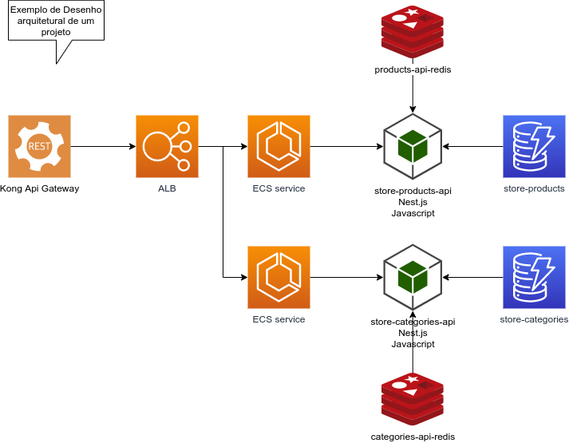
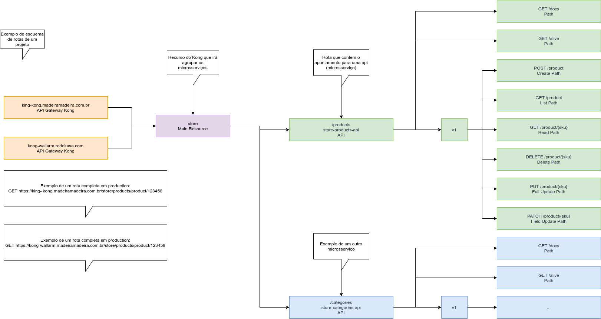
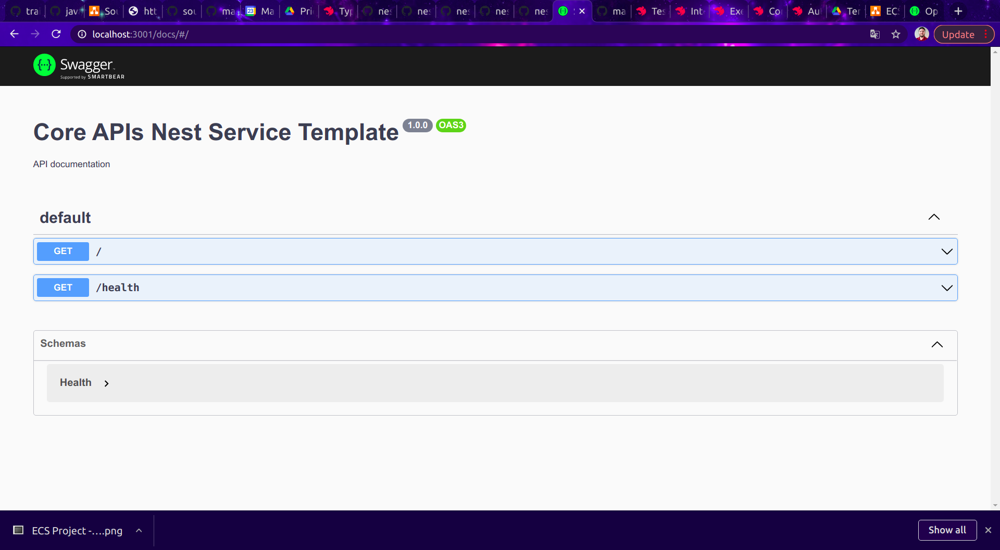

# Core APIs NestJS Service Template

MadeiraMadeira boilerplate project to build scalable, testable and high performance Node.js microservices. 

## Service Architecture
This service make part of the project <project name>.

> Obs: image to describe the service architecture or project architecture.

## General Kong Routes Architecture
Kong routes map.


> Obs: image to describe the service routes or project routes.

## Stack

- [NestJS](https://github.com/nestjs/nest): a progressive Node.js + TypeScript framework based on dependency injection;
- [gRPC](https://grpc.io): a Remote Procedure Call framework that provides high performance communication between microservices.
- [Swagger + OpenAPI](https://swagger.io/specification/): an OpenAPI definition can then be used by documentation generation tools to display the API, code generation tools to generate servers and clients in various programming languages, testing tools, and many other use cases. 

## Swagger Docs
The current documentation of the project can be found on url `/docs`.


## Release notes
In this section contains the release notes of the project.

> Version 1.0.0

First version of the project;
All the changes must be tracked in [CHANGELOG.md](CHANGELOG.md)

## Prerequisites
- Node 12

## Features
- REST and gRPC layers;
- Swagger; 
- Husky Git hooks that automatically runs [ESLint](https://eslint.org) and [Prettier](https://prettier.io) before all commits;
- `ConfigService`: easily manage environment variables;
- `Health` module: a gRPC and a REST endpoint that displays relevant information about the application status;
- Docker infrastructure with Docker Compose.

## Installation
### Preparing the environment
Copy the sample env file using the follow command:
```bash
cp example.env .env
```

### Running locally
Execute the follow command:
```bash
npm install
```
#### Running the app

```bash
# local development
$ npm run start

# local watch mode
$ npm run start:dev

# local production mode
$ npm run start:prod
```


### Running via docker
To execute the build (first exection):
```bash
./bin/runenv.sh --build
```
Execute the follow command:
```bash
./bin/runenv.sh
```
### Boot extra resources
If the project has SQS Queues or others resources you can boot after the environment is ready.

Execute the follow command:
```bash
./bin/boot.sh
```

## Samples
See the project samples in this folder [here](samples).

## Endpoints
* gRPC: use a gRPC client (like [Kreya](https://kreya.app) or [Insomnia](https://insomnia.rest)): 
    - `http://localhost:5000/health.HealthService.GetStatus`
    
* REST: 
    - `http://localhost:3001`:  
        - `GET /`        
        - `GET /alive`
        - `GET /docs`
        - `GET /v1/product`

## Tests
Some information about tests:
See: [https://martinfowler.com/articles/microservice-testing/#testing-progress-3](https://martinfowler.com/articles/microservice-testing/#testing-progress-3)

### Tests application in this project
- Unit tests - Logic validation with mocks;
- Component tests - Validation with resources from docker images, using fixture resources to build the enviroment like:
  queues, nosql databases and relational databases;
- Integration tests - Validation of integration with staging enviroment (write and read operations only).

### Diagram ot exemplify the general idea


## Running test
To run the unit tests of the project you can execute the follow command:

### Unit tests
Execute the follow command:
```bash
npm run test
```

### Component tests
Start the docker containers:
```bash
./bin/runenv.sh
```

Booting the environment:
```bash
./bin/boot.sh
```

Executing the tests:
```bash
npm run test:component
```

### Integration tests:
Copy the file `integration.example.env` to `integration.env` and edit it with de staging parameters.

Executing the tests:
```bash
npm run test:integration
```
### End-to-End tests
```bash
npm run test:e2e
```
### Generating coverage reports
To execute coverage tests you can execute the follow commands:
#### Unit test coverage
Execute the follow command:
```bash
npm run test:cov
```

#### Component test coverage
Execute the follow command:
```bash
npm run test:component-cov
```

#### Integration test coverage
Execute the follow command:
```bash
npm run test:integration-cov
```

> Observation:
> The result can be found in the folder `target/*`.


## License
See the license [LICENSE.md](LICENSE.md).

## Contributions
- [Guilherme M. Lopes](https://github.com/GuilhermeMLS)
- [Gabriel Miranda](https://github.com/gabe-miranda)
- [Angelo Weiss](https://github.com/FerraBraiZ)
- [Pedro Fellipe](https://github.com/PedroFellipe) 
- [Anderson de Oliveira Contreira](https://github.com/andersoncontreira)

## Getting started with boilerplate

Download and extract the project, then:
```bash
mv skeleton-nest-microservice-api {your_project_name}
git init
git remote add origin https://github.com/{user}/{repo}.git
```

> Hint: use `$ git remote -v` to verify new remote
